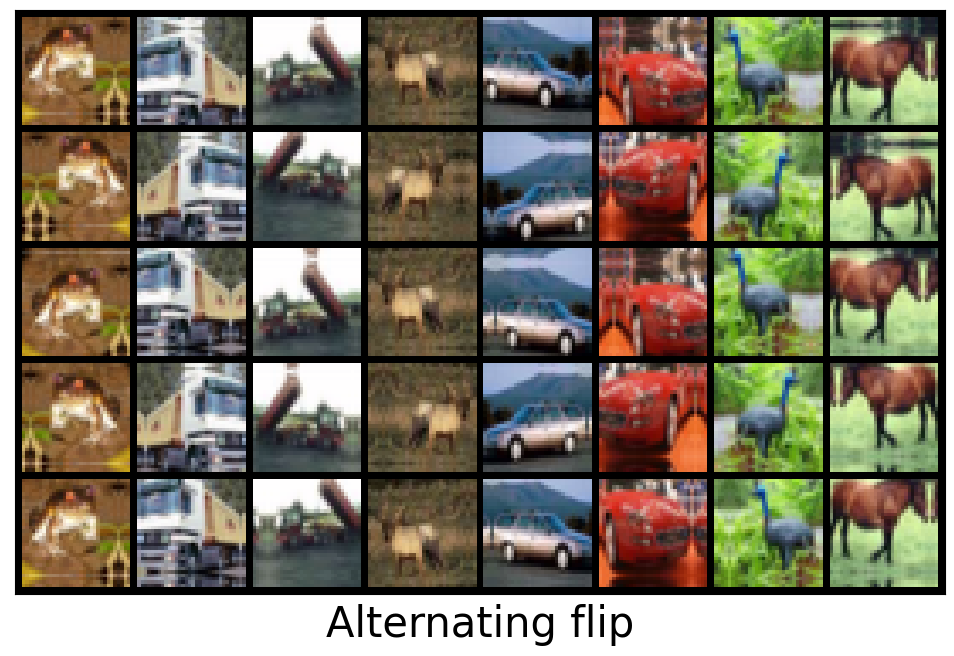
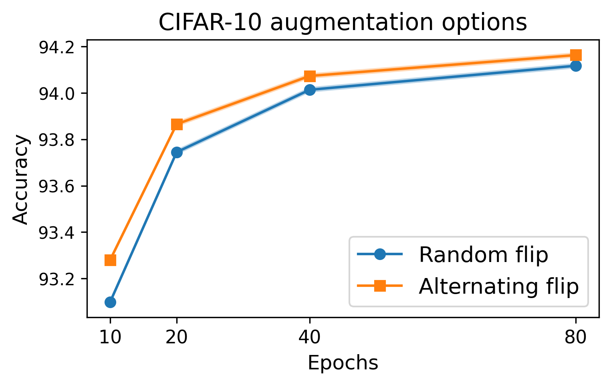

# CIFAR-10 Airbench 💨

This repo contains the two fastest known algorithms for training a neural network to 94% and 96% accuracy on CIFAR-10 using a single NVIDIA A100 GPU.

| Script | Mean accuracy | Time | PFLOPs |
| - | - | - | - |
| [airbench94_muon.py](./airbench94_muon.py) | 94.01% | 2.59s | 0.29 |
| [airbench96_faster.py](airbench96_faster.py) | 96.00% | 27.3s | 3.1 |

(Timings done using `torch==2.4.1` on a 400W NVIDIA A100)

For comparison, the standard training used in most studies on CIFAR-10 is much slower:

| Baseline | Mean accuracy | Time | PFLOPs |
| - | - | - | - |
| Standard ResNet-18 training | 96.0% | 7min | 32.3 |

## Quickstart

The current speedrun record for 94% on CIFAR-10 can be run via:
```
git clone https://github.com/KellerJordan/cifar10-airbench.git
cd airbench
python airbench94_muon.py
```

(requires `torch` and `torchvision` to be installed)

## Methods

The set of methods used to obtain these training speeds are described in [the paper](https://arxiv.org/abs/2404.00498).

In addition, [airbench94_muon.py](airbench94_muon.py) uses the [Muon optimizer](https://kellerjordan.github.io/posts/muon/) and [airbench96_faster.py](airbench96_faster.py) uses a form of data filtering. These are both new records since the paper.
We have preserved the old records from the paper as well:

| Script | Mean accuracy | Time | PFLOPs |
| - | - | - | - |
| [airbench94_compiled.py](legacy/airbench94_compiled.py) | 94.01% | 3.09s | 0.36 |
| [airbench94.py](legacy/airbench94.py) | 94.01% | 3.83s | 0.36 |
| [airbench95.py](legacy/airbench95.py) | 95.01% | 10.4s | 1.4 |
| [airbench96.py](legacy/airbench96.py) | 96.03% | 34.7s | 4.9 |




## Motivation

CIFAR-10 is one of the most widely used datasets in machine learning, facilitating [thousands of research projects per year](https://paperswithcode.com/dataset/cifar-10). 
This repo provides fast and stable training baselines for CIFAR-10 in order to help accelerate this research.
The trainings are provided as easily runnable dependency-free PyTorch scripts, and can replace classic baselines like training ResNet-20 or ResNet-18.

## Using the GPU-accelerated dataloader independently

For writing custom CIFAR-10 experiments or trainings, you may find it useful to use the GPU-accelerated dataloader independently.
```
import airbench
train_loader = airbench.CifarLoader('/tmp/cifar10', train=True, aug=dict(flip=True, translate=4, cutout=16), batch_size=500)
test_loader = airbench.CifarLoader('/tmp/cifar10', train=False, batch_size=1000)

for epoch in range(200):
    for inputs, labels in train_loader:
        # outputs = model(inputs)
        # loss = F.cross_entropy(outputs, labels)
        ...
```

If you wish to modify the data in the loader, it can be done like so:
```
import airbench
train_loader = airbench.CifarLoader('/tmp/cifar10', train=True, aug=dict(flip=True, translate=4, cutout=16), batch_size=500)
mask = (train_loader.labels < 6) # (this is just an example, the mask can be anything)
train_loader.images = train_loader.images[mask]
train_loader.labels = train_loader.labels[mask]
print(len(train_loader)) # The loader now contains 30,000 images and has batch size 500, so this prints 60.
```

## Example data-selection experiment

Airbench can be used as a platform for experiments in data selection and active learning.
The following is an example experiment which demonstrates the classic result that low-confidence examples provide more training signal than random examples.
It runs in <20 seconds on an A100.

```
import torch
from airbench import train94, infer, evaluate, CifarLoader

net = train94(label_smoothing=0) # train this network without label smoothing to get a better confidence signal

loader = CifarLoader('cifar10', train=True, batch_size=1000)
logits = infer(net, loader)
conf = logits.log_softmax(1).amax(1) # confidence

train_loader = CifarLoader('cifar10', train=True, batch_size=1024, aug=dict(flip=True, translate=2))
mask = (torch.rand(len(train_loader.labels)) < 0.6)
print('Training on %d images selected randomly' % mask.sum())
train_loader.images = train_loader.images[mask]
train_loader.labels = train_loader.labels[mask]
train94(train_loader, epochs=16) # yields around 93% accuracy

train_loader = CifarLoader('cifar10', train=True, batch_size=1024, aug=dict(flip=True, translate=2))
mask = (conf < conf.float().quantile(0.6))
print('Training on %d images selected based on minimum confidence' % mask.sum())
train_loader.images = train_loader.images[mask]
train_loader.labels = train_loader.labels[mask]
train94(train_loader, epochs=16) # yields around 94% accuracy => low-confidence sampling is better than random.
```

## Prior work

This project builds on the excellent previous record https://github.com/tysam-code/hlb-CIFAR10 (6.3 A100-seconds to 94%).

Which itself builds on the amazing series https://myrtle.ai/learn/how-to-train-your-resnet/ (26 V100-seconds to 94%, which is >=8 A100-seconds)

